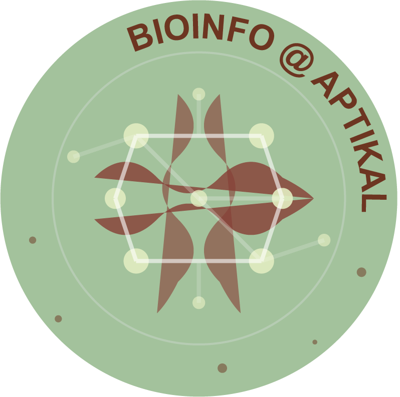

I am a bioinformatician with a background in molecular biology and genetics, specialized in computational biology. Since 2018, I have been a CNRS researcher, focusing on tumor heterogeneity through the integration of experimental and computational approaches. My research spans both the development of novel methodological frameworks and the study of cancer biology. 

## Research group 

  

  

    In 2025, I joined the 
    <a href="https://www.liglab.fr/fr" target="_blank">
      Laboratoire d'Informatique de Grenoble
    </a>
    to establish a bioinformatics group named <a href="https://bioinfo-lig.github.io/" target="_blank">
      Bioinfo@APTIKAL
    </a> , with my colleague Antoine Frénoy.
    Our group is part of the team
    <a href="https://lig-aptikal.imag.fr/" target="_blank">
      APTIKAL
    </a>, specialized in machine learning and information modelling for complex data.
    
  

## Research environment 

I am actively involved in the network [BiGre](https://bi-gre.github.io/) (Computational Biology in Grenoble).

I am also actively engaged in promoting collaborative science by organizing data challenges. I am a director of [ChaLearn](http://www.chalearn.org/) organisation, and an administrator of the [Academic Committee for Data Challenges](https://gricad.univ-grenoble-alpes.fr/en/research-support/acdc/) of the University Grenoble Alpes.

