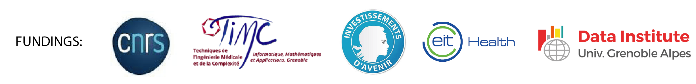

Our group is interested in developing computational methods for a better understanding of the diversity of genetic and epigenetic variations in the context of cancer.

We are located at [TIMC](https://www.timc.fr/) in the [MAGe](https://www.timc.fr/en/mage) team, CNRS, Université Grenoble Alpes.

[Research projects](research.html)

[Open Science : data Challenges and benchmarking projects](open_science.html)

[People](people.html)

[Publications](publication.html)

[Teaching](teaching.html)

Footer and header Pictures: [Harry Gruyaert](https://www.ecosia.org/images?c=fr&p=13&q=harry+gruyaert#id=_)©

