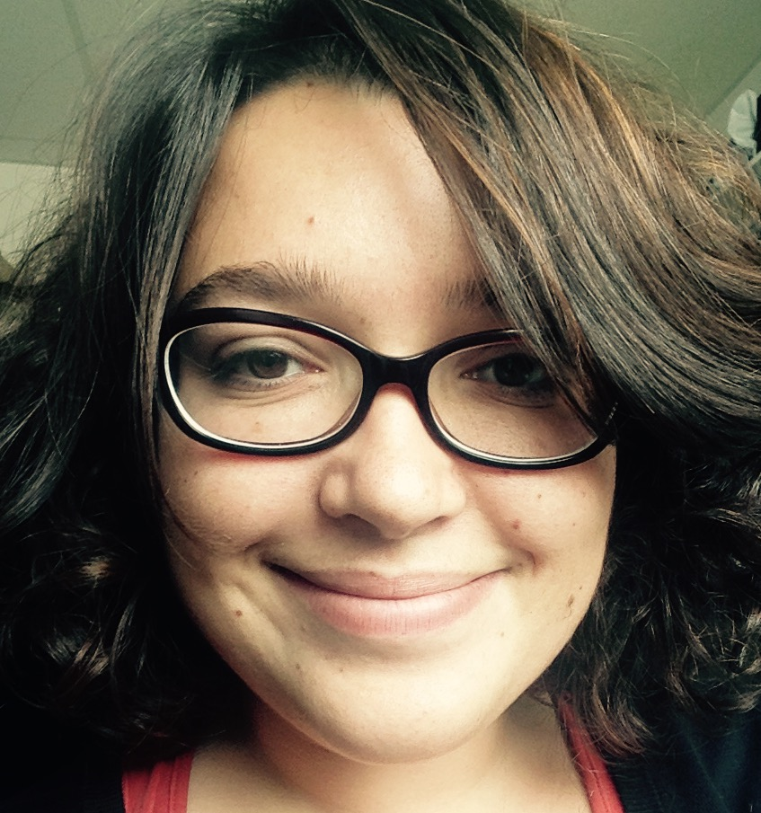

<style>
.column-left{
  float: left;
  width: 20%;
  text-align: right;
}
.column-right{
  float: left;
  width: 80%;
  text-align: left;
}
</style>

<div class="column-left">
```{r, out.width = "100px", echo=FALSE, fig.align='center'}

``` 
</div>

<div class="column-right">
**Magali Richard** (PI), for more details, see my [CV](CV.pdf).

Computational biologist specialized in experimental and theoritical genetics. 

CNRS research associate (CRCN), computational biologist

Contact: magali.richard[at]univ-grenoble-alpes.fr

</div>

<div class="column-left">
```{r, out.width = "90px", echo=FALSE, fig.align='center'}
knitr::include_graphics("pictures/florence.jpg")
``` 
</div>


<div class="column-right">
**Florence Pittion** 

Mediation analysis of tumor heterogeneity

PhD student in biostatistics

Contact: florence.pittion[at]univ-grenoble-alpes.fr
</div>

******
******
******

------


<div class="column-left">
```{r, out.width = "80px", echo=FALSE, fig.align='center'}
knitr::include_graphics("pictures/elise.jpg")
``` 
</div>

<div class="column-right">
**Elise Amblard** ,

Mutliomic data integration and tumor heterogeneity quantification 

Postdoc in biostatistics

Contact: elise.amblard[at]univ-grenoble-alpes.fr
</div>

------
\newpage

\vspace{12pt}

**ALUMNI**

Clémentine Décamps (2018-2021), PhD, Computational biology of cancer epigenetics

Slim Karkar (2020-2021), Postdoc, Multiomic data integration and tumor heterogeneity quantification 

Yasmina Kermezly (2020-2021), Postdoc, Single-cell based tumor heterogeneity deconvolution

Fabien Quinquis (2021), Master student, Genetic regulation of tumor heterogeneity

Alexis Arnaud (2020), Engineer, data challenge (financed by the Data institute of grenoble)

Milan Jacobi (2019), Master student, DNA methylation statistical analysis

Bahareh Afshinpour (2019), Engineer, DNA methylation data treatment & analysis

Raphael Bacher (2018), Engineer, data challenge (financed by the Data institute of grenoble)

Arthur Waguet (2018), Master student, Signal treatment & cancer heterogeneity

Paul Terzian (2017), Master student, computational biology of cancer epigenetics


