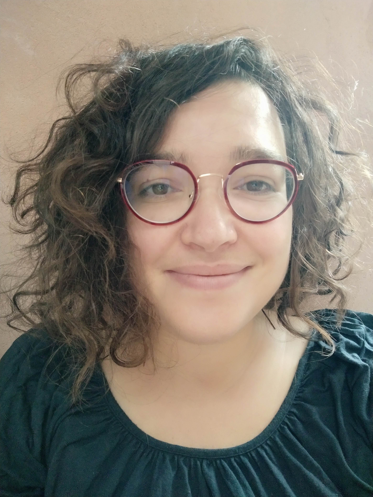
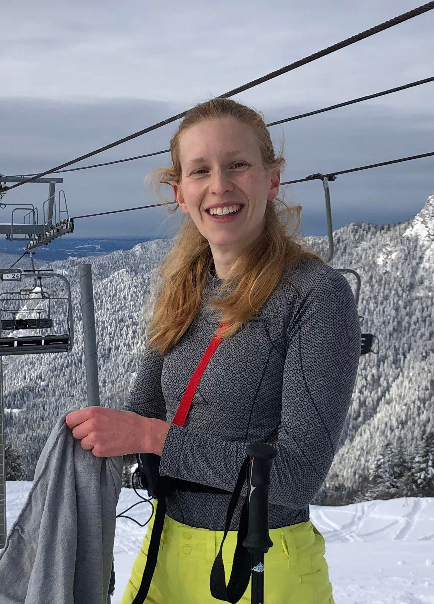
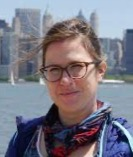
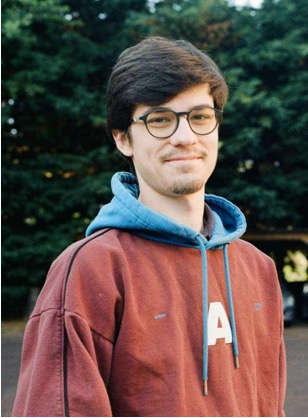
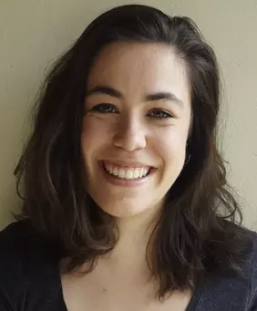

**CURRENT MEMBERS**

**Magali Richard (PI)** :

- Computational biologist specialized in experimental and theoritical genetics 
- CNRS research associate (CRCN) 
- Contact: magali.richard[at]univ-grenoble-alpes.fr

**Elise Amblard** :

- Mutliomic data integration and tumor heterogeneity quantification 
- Postdoc in biostatistics 
- Contact: elise.amblard[at]univ-grenoble-alpes.fr

**Florence Pittion** : 

- Mediation analysis of tumor heterogeneity 
- PhD student in biostatistics 
- Contact: florence.pittion[at]univ-grenoble-alpes.fr

**Hugo Barbot** : 

- Statistical inférence of cellular heterogeneity using multi-omic prior biological knowledge  
- PhD student in statistics, co-supervised by Yuna Blum (IGDR, Rennes) and David Causeur (IRMAR, Rennes)
- Contact: hugo.barbot[at]univ-grenoble-alpes.fr

**Lucie Lamothe** : 

- Single-cell based deconvolution, computational lab managment, data challenge organisation  
- IR in bioinformatics
- Contact: lucie.lamothe[at]univ-grenoble-alpes.fr

---------------------------------

**ALUMNI**

Vadim Bertrand (2023), Master student, Multiomic data integration

Clémentine Décamps (2018-2021), PhD, Computational biology of cancer epigenetics

Slim Karkar (2020-2021), Postdoc, Multiomic data integration and tumor heterogeneity quantification 

Yasmina Kermezly (2020-2021), Postdoc, Single-cell based tumor heterogeneity deconvolution

Fabien Quinquis (2021), Master student, Genetic regulation of tumor heterogeneity

Alexis Arnaud (2020), Engineer, data challenge (financed by the Data institute of grenoble)

Milan Jacobi (2019), Master student, DNA methylation statistical analysis

Bahareh Afshinpour (2019), Engineer, DNA methylation data treatment & analysis

Raphael Bacher (2018), Engineer, data challenge (financed by the Data institute of grenoble)

Arthur Waguet (2018), Master student, Signal treatment & cancer heterogeneity

Paul Terzian (2017), Master student, computational biology of cancer epigenetics

