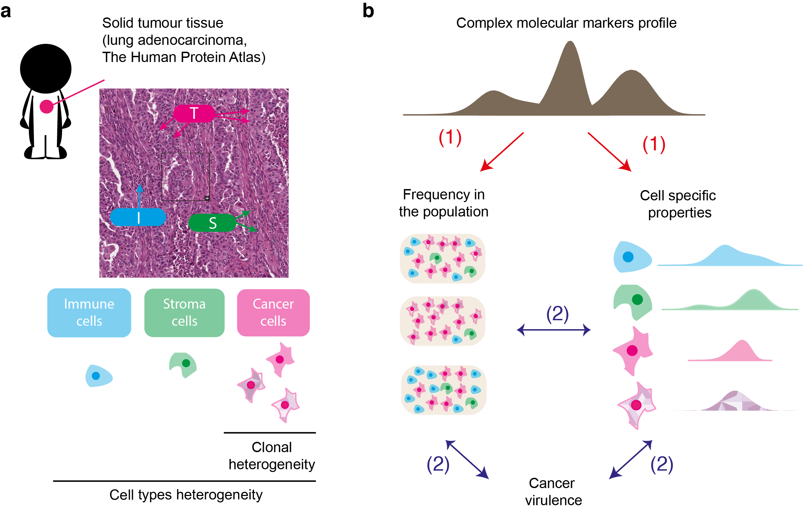
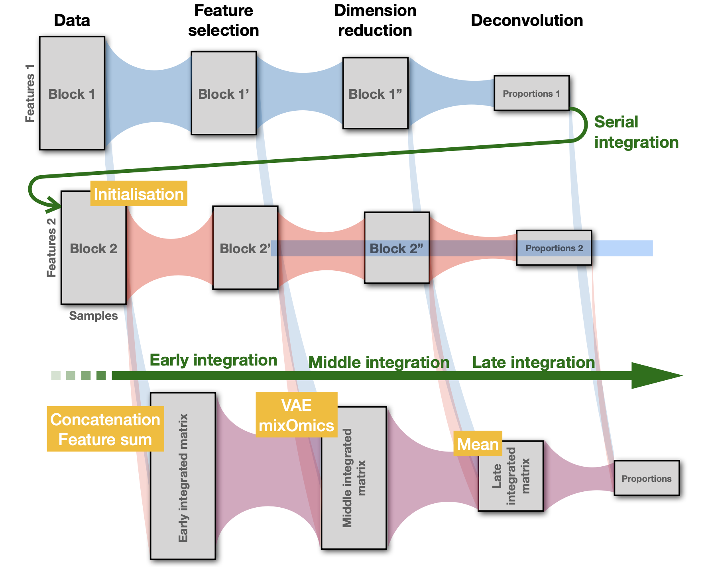
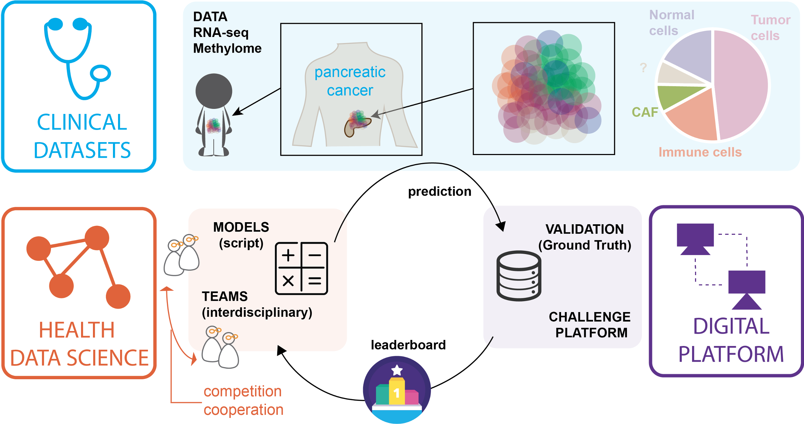
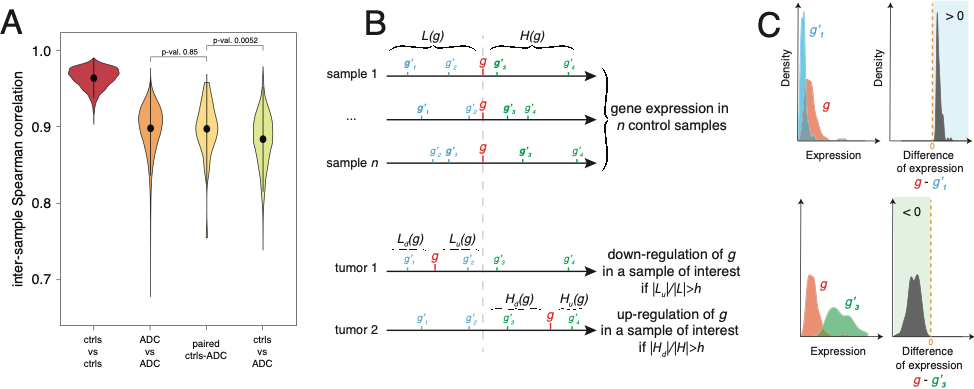

<style>
.column-left{
  float: left;
  width: 33%;
  text-align: left;
}
.column-center{
  display: inline-block;
  width: 33%;
  text-align: center;
}
.column-right{
  float: right;
  width: 50%;
  text-align: right;
}
</style>


***

## Tumor heterogeneity  


<div class="column-right">
```{r, out.width = "300px", echo=FALSE, fig.align='center'}

``` 
</div>

  A major challenge for current research in oncology is to integrate data and existing information into a model that takes into account intra- tumour heterogeneity. Such approach would offer a better understanding of the biological mechanisms involved in the evolution of cancer cells, which will improve the development of adapted therapeutic strategies.

  We address this challenge by establishing an original analytical framework for the study and analysis of complex biological data derived from tumours, and to provide a novel type of information about intra-tumour heterogeneity and cancer virulence.


***

## Multimodal data integration 


<div class="column-right">
```{r, out.width = "300px", echo=FALSE, fig.align='center'}

``` 
</div>

  So far, most statistical methods used for cell deconvolution ignore the biological relationships between the molecular features used in the models. Our goal is to provide a statistical framework for deconvolution including (i) the stochastic dependence across molecular features induced by the mutual regulation mechanisms; (ii) the a priori knowledge of the topology of multilayer interaction networks; and (iii) the similarity between samples that may be induced by controlled experimental conditions.

  We expect that using different types of omic data should improve the quality of tumor heterogeneity quantification by (i) removing the bias specific to each type of data and (ii) better identifying the relevant features in both datasets using joint information provided by both data types. 

***

## Data challenges and Benchmarks 


<div class="column-right">
```{r, out.width = "300px", echo=FALSE, fig.align='center'}

``` 
</div>

Codabench is an open-source, web-based data challenge platform primarily utilized by the machine learning community to orchestrate public competitions in the field data science analysis. 
Codabench offers the possibily to organize flexible competitions and benchmark, thus contributing to the development of advanced methods in data analysis and promoting reproducibility of results. In addition, it facilitates hands-on learning and fosters collaboration within the scientific community. 

We contribute to the development of codabench and organize regular data challenge in Health. Our next objective would be to establish a federation of Codabench platforms across various academic sites, facilitating the sustainable growth of the platform while ensuring the capability to archive and retrieve each past competition.


***

## (Epi)genetic regulation and variability


<div class="column-right">
```{r, out.width = "300px", echo=FALSE, fig.align='center'}

``` 
</div>


  
  Combining statistical analysis and quantitative mathematical modeling with molecular biology experiments on specific cell lines and on tumors, we aim at discovering epigenetically regulated genomic domains in lung cancer, as well as at characterizing and modeling these epigenetic “hot” domains and their association with tumor progression and aggressiveness.


  